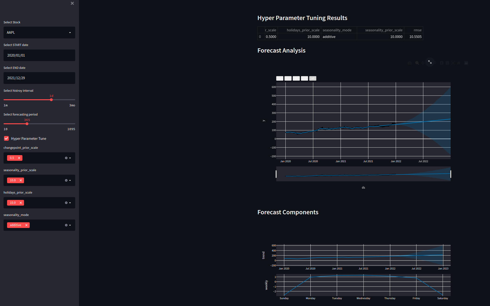
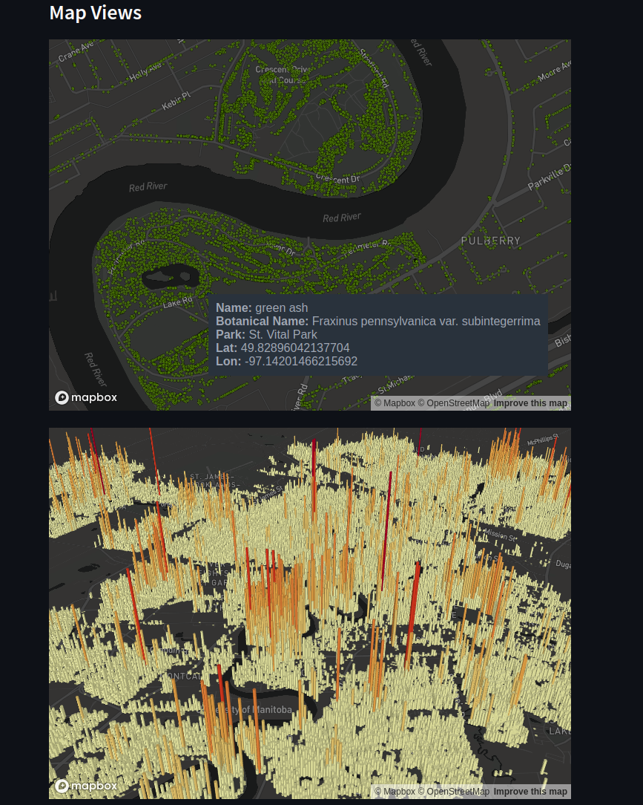
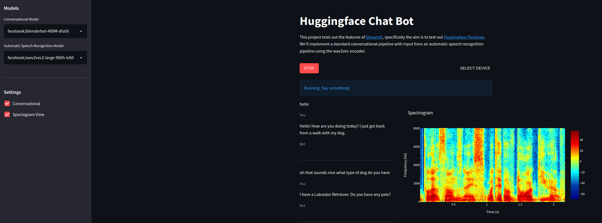
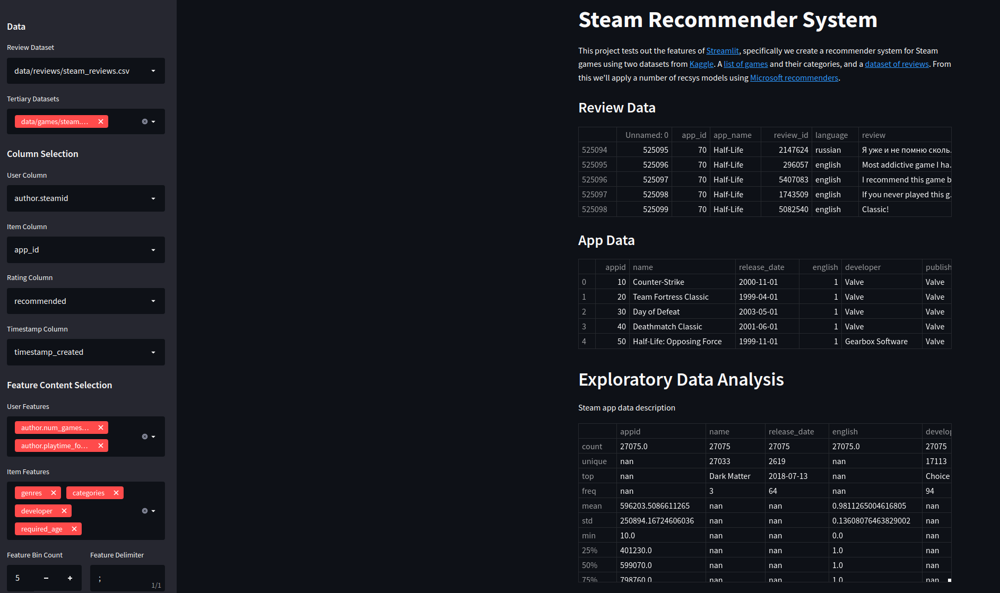

# Streamlit Gallery 🖼️

This is a gallery of basic apps to learn [Streamlit](https://streamlit.io/), and other various tools.

This gallery currently includes:

- **📈 [Stock prediction](stockpred/)** - First app, using [Prophet](https://facebook.github.io/prophet/).
- **🌳 [Tree Inventory](trees/)** - To test [deck.gl](https://deck.gl/) features in streamlit, and other map data on a local dataset.
- **🤖 [Chatbot](chatbot/)** - A chatbot using WebRTC, an ASR pipeline, a conversational pipeline, and speech synthesis to create a conversational chatbot. Tests [pipelines](https://huggingface.co/docs/transformers/main_classes/pipelines) in [Hugging Face 🤗](https://huggingface.co/docs/transformers/main_classes/pipelines).
- **🥇 [Steam Recommender System](recsys/)** - Tests multiple algorithms from the [Microsoft Recommenders](https://github.com/microsoft/recommenders) repo, on a steam reviews dataset.
- **🖼️ [Stable Diffusion](stockpred/)** - Text to image generation using [Stable Diffusion](https://huggingface.co/stabilityai/stable-diffusion-2-1) pipelines.

## How to Run

Instructions to run each app can be found in their respective folders.

## Results

A quick demo of some apps in the gallery

**📈 [Stock prediction](stockpred/)**

**🌳 [Tree Inventory](trees/)**

**🤖 [Chatbot](chatbot/)**

**🥇 [Steam Recommender System](recsys/)**

