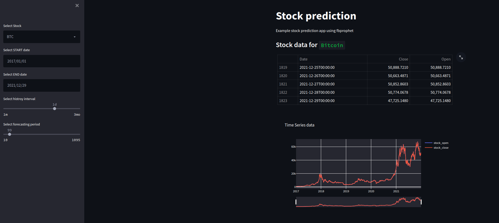
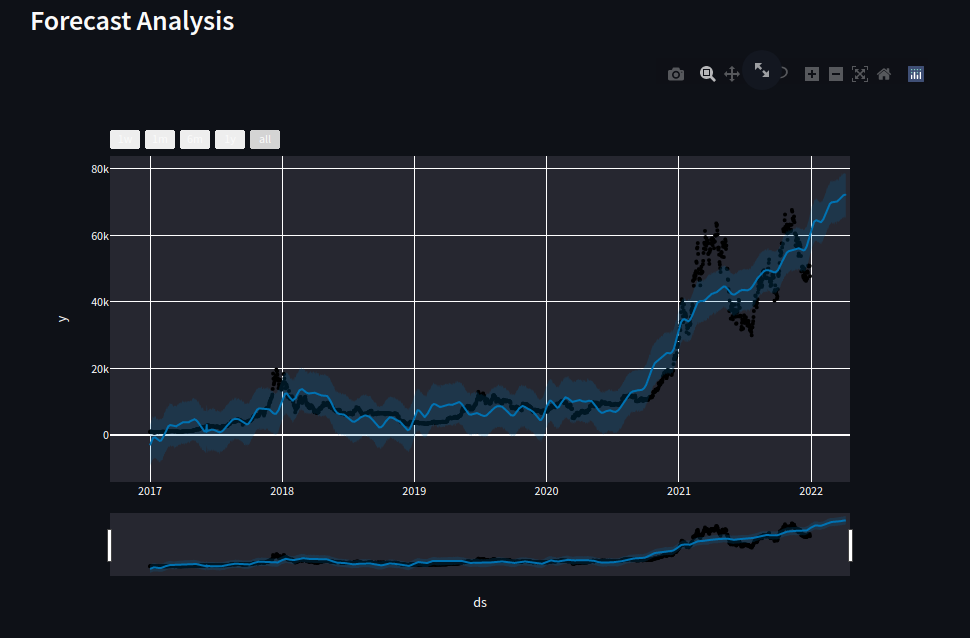
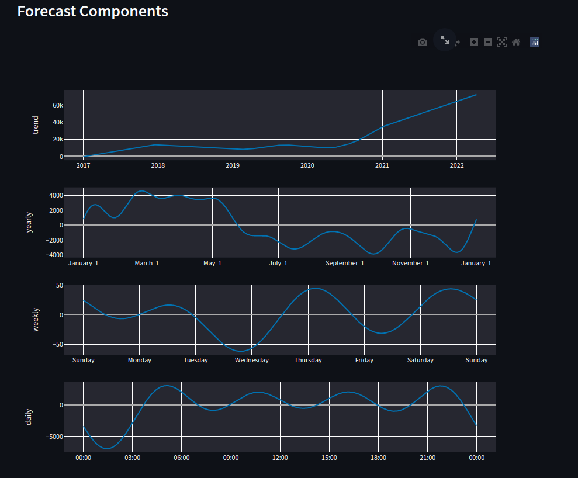
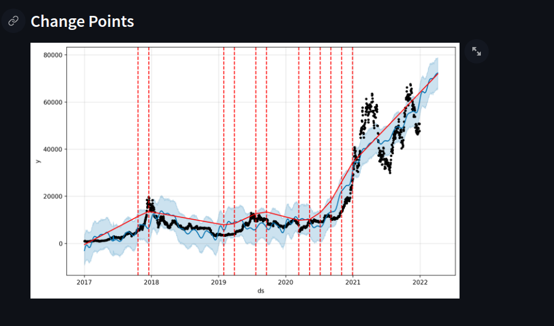

# Streamlit Stock Prediction Tests

This project tests out the features of [Streamlit](https://streamlit.io/), using historical stock prices and crypto market prices. We make predictions of future prices using [Prophet](https://facebook.github.io/prophet/) forecasts for fun.

## How to run

First install [Poetry](https://python-poetry.org/), and then install dependencies using

```sh
poetry install
```

Now we can run streamlit using

```sh
streamlit run streamlit_app.py
```

## Results

If you want a quick cursory glance at this project we can see the results here






You can also tune hyperparamters to better obtain better fits

