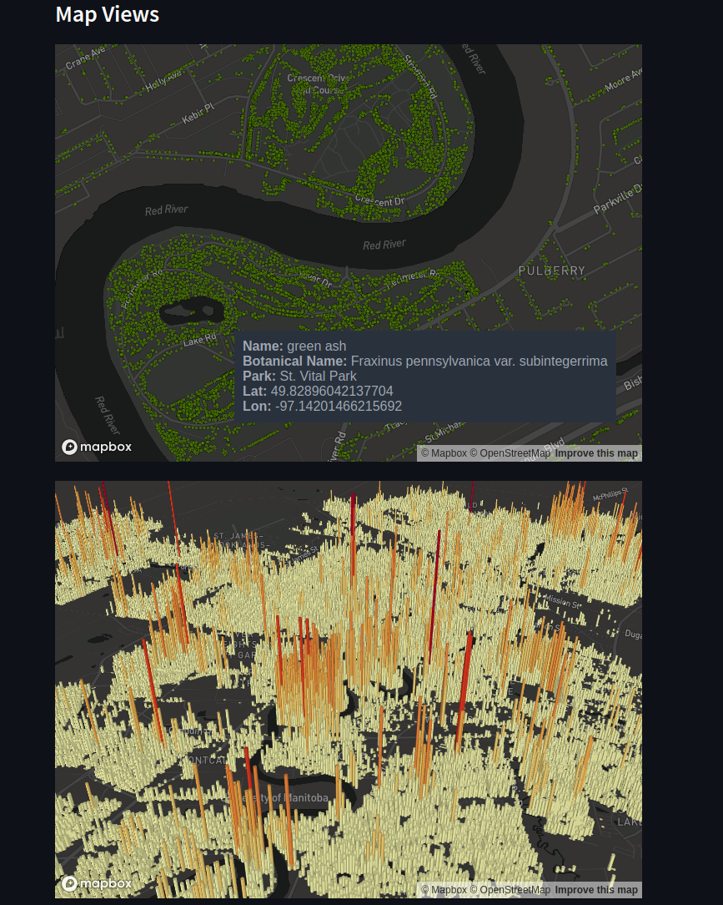

# Streamlit Tree Inventory Tests

This project tests out the features of [Streamlit](https://streamlit.io/), specifically the mapping features of [PyDeck](https://deckgl.readthedocs.io/en/latest/) on the Winnipeg [Tree Inventory](https://data.winnipeg.ca/Parks/Tree-Inventory/hfwk-jp4h) dataset. This is partially done to also test the Winnipeg Open data portal.

## How to run

First install [Poetry](https://python-poetry.org/), and then install dependencies using

```sh
poetry install
```

Make sure to set an API key for mapbox in `.streamlit/config.toml`

```toml
[mapbox]

token = "YOUR_MAPBOX_API_KEY_HERE"
```

Now we can run streamlit using

```sh
streamlit run streamlit_app.py
```

## Results

You can see a brief overview of what was done in the results here





